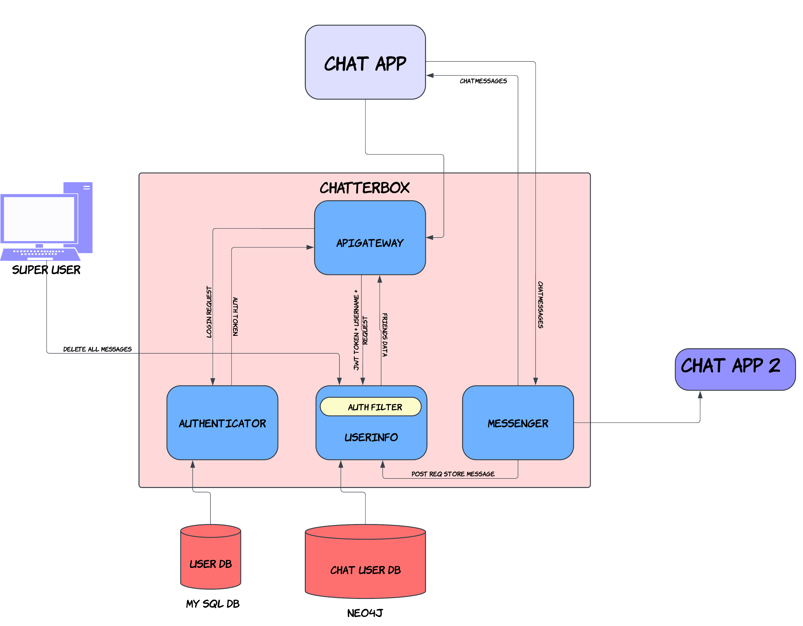

# Chatterbox
Chatter box is a backend for a chat app. 
I decided to write a chat application where I can implement microservices and I can also write an iOS frontend application. I got to do some system design and write code. The aim for frontend is not to be pretty but to be functional. Step one is to create a functional application with bare minimum features to call it a chat app. Later I will like to add more features to it.

**The system roughly looks like this**

## My process DUMP

I wrote an `apigateway` because It is good to have one entry point and in future if I want to try adding loadbalancers etc to the thing it would be much easier. Right now it routes requests and check authenticates the request.
The other service `authenticator` because it would be logical to keep a seperate service to handle user verification process as I would not need to provide user password etc to multiple services. I can also add other features such as password change, forgot password etc with this service. For login this service creates a JWT token which the App stores for any further requests.
Next we have `userinfo` currently it returns friends list, last_chatted etc. but planning to add features like add friends, make groups etc. which this service can handle. 

Finally the core functionality is Handled by `messenger` service. It is a gRPC server for handling messages between users.

## The DATABASES
- MySQL for storing usernames, password etc.
- Neo4j for storing all the relationships between users. Like who is friends with whom etc. 

## The APIs 

apigateway routes the requests to various other services, acting as a single point of entry.\n

It offers the following enpoints:
| endpoint | Type | Response Type | Description |
| ---------|---------|---------|---------|
| /home | GET REQUEST | String | gets you the home page |
| /fallback | GET REQUEST | String | The standard fallback page for every request |
| /auth | POST REQUEST | AuthResponse | apigateway routes the request to authenticator |
| /chat | GET REQUEST | GetResponse | apigateway routes the request to userinfo service |

messenger service offers the following service

### ChatService
Service that handles sending messages to other users

| Method Name | Request Type | Response Type | Description |
| ----------- | ------------ | ------------- | ------------|
| SendMessage | [ChatMessage](#org-harshit-messenger-chat-ChatMessage) | [ChatMessageResponse](#org-harshit-messenger-chat-ChatMessageResponse) | Sends message to the server |
| StreamMessage | [ChatMessage](#org-harshit-messenger-chat-ChatMessage) stream | [ChatMessageResponse](#org-harshit-messenger-chat-ChatMessageResponse) | Stream messages to the server. The server responds at the end of the stream |
| SendMessagesGRPC | [ChatMessage](#org-harshit-messenger-chat-ChatMessage) stream | [ChatMessage](#org-harshit-messenger-chat-ChatMessage) stream | Stream messages to the server which server then forwards to the intended user |

